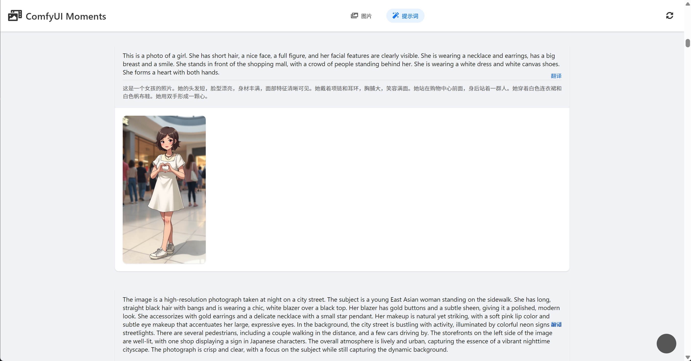
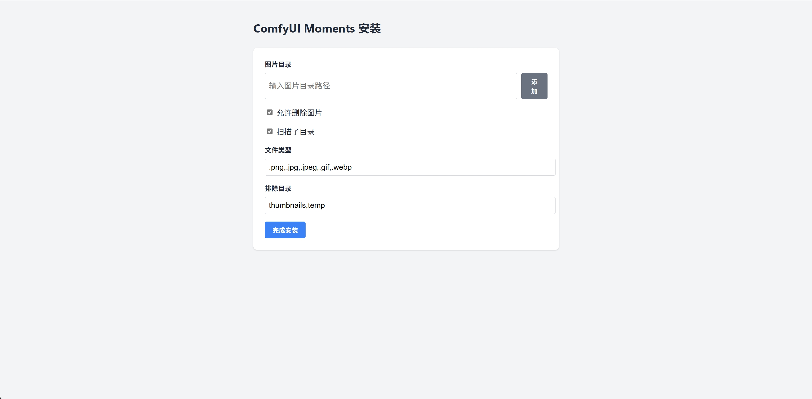

# ComfyUI Moments

这是一个专门用于浏览和管理 ComfyUI 生成的图片文件，当然其他目录的图片也可以。它支持按日期查看图片，显示详细的图片工作流信息，并可以方便将图片移动到回收站。


### 主页面


### 图片详情页面


### 提示词页面


> 提示词的提取目前只提取CLIP中的文本，对于传入的字符串，目前还提取不了

## 功能特点

- 按日期浏览 ComfyUI 生成的图片
- 显示详细的图片元数据，支持鼠标缩放和拖动，包括 ComfyUI 工作流信息
- 支持将图片移动到系统回收站
- 响应式设计，适配桌面和移动设备
- 简洁直观的用户界面
- 支持 Docker 部署，查看[Docker部署指南](DOCKER_DEPLOY.md)

## 安装

1. 确保您已安装 Python 3.7 或更高版本。

2. 克隆仓库：
``` bash
git clone https://github.com/liuqianhonga/ComfyUI-Moments.git
cd ComfyUI-Moments
```

3. 安装依赖：
``` bash
pip install -r requirements.txt
```

## 配置
选择下面其中一种

### 页面配置

1. 首次运行应用时，会自动跳转到安装页面。
2. 在安装页面中，您可以进行以下配置：
   - 设置图片目录路径
   - 选择是否允许删除图片
   - 选择是否允许打开图片目录
   - 选择是否允许访问安装页面
   - 选择是否扫描子目录
   - 设置要扫描的文件类型
   - 设置要排除的目录
3. 完成配置后，点击"完成安装"按钮保存设置。




### 手动配置
1. 复制 `config.ini.example` 文件并重命名为 `config.ini`。
2. 打开 `config.ini` 文件。
3. 在 `images_dirs` 设置中，指定您的 ComfyUI 输出目录路径，多个目录用英文逗号隔开。
4. 设置 `allow_delete_image` 为 `True` 或 `False` 来启用或禁用删除图片功能。
5. 设置 `allow_open_directory` 为 `True` 或 `False` 来启用或禁用打开图片目录功能。
6. 设置 `allow_install_page` 为 `True` 或 `False` 来启用或禁用安装页面访问功能。
7. `scan_subdirectories`：是否扫描子目录。为 `True` 或 `False` 来启用或禁用。
8. `file_types`：指定要扫描的文件类型。如：.png,.jpg,.jpeg,.gif,.webp
9. `exclude_dirs`：指定要排除的目录名。如：thumbnails,temp

```ini
[settings]
images_dirs = E:\AI\ComfyUI\output
allow_delete_image = True
allow_open_directory = True
allow_install_page = True

[advanced]
scan_subdirectories = True
file_types = .png,.jpg,.jpeg,.gif,.webp
exclude_dirs = thumbnails,temp
```

### Docker 配置

在 Docker 环境中，为了增强安全性，默认会禁用以下功能：
- 删除图片功能 (`allow_delete_image = False`)
- 打开图片目录功能 (`allow_open_directory = False`)
- 安装页面访问功能 (`allow_install_page = False`)

您可以根据需要在 `config.ini.docker` 中修改这些设置。

## 运行应用

要运行 ComfyUI Moments，请按照以下步骤操作：

1. 确保您已经安装了所有必要的依赖项。运行以下命令安装依赖：

   ```bash
   pip install -r requirements.txt
   ```

2. 打开终端或命令提示符，导航到项目目录。

3. 运行 `extract_prompts.py` 提取提示词。

4. 运行以下命令启动应用：

   ```bash
   python app.py
   ```

   默认情况下，应用将在 `http://127.0.0.1:5000` 上运行。

5. 如果您想指定不同的 IP 地址或端口，可以使用以下参数：

   - `--listen`: 指定要监听的 IP 地址（默认为 127.0.0.1）
   - `--port`: 指定要使用的端口（默认为 5000）

   例如，要让应用监听所有网络接口并使用 8080 端口，可以运行：

   ```bash
   python app.py --listen=0.0.0.0 --port=8080
   ```

6. 应用启动后，它会自动在默认浏览器中打开。如果没有自动打开，您可以手动在浏览器中输入地址访问应用。

注意：
- 当使用 `0.0.0.0` 作为监听地址时，应用将接受来自任何 IP 地址的连接。在公共网络上使用时请谨慎，确保采取适当的安全措施。
- 建议定期运行 extract_prompts.py 更新提示词缓存
- 大量图片首次提取可能需要较长时间
- 翻译功能使用免费的翻译 API，可能有请求限制

## 使用说明

1. 主页面会按日期显示所有图片。
2. 点击图片可以查看大图和详细元数据。
3. 在图片详情页面，可以查看 ComfyUI 工作流信息。
4. 使用删除按钮可以将图片移动到系统回收站。

## 许可证

本项目采用 MIT 许可证。详情请见 [LICENSE](LICENSE) 文件。
